# Concorrente

* Como não existe sincronização no código de "concorrente", o mesmo se encontra na famosa "condição de corrida", onde duas threads podem acabar acessando a informação e "gettando/settando" ao mesmo tempo. Nesse caso eu acredito que deveriamos usar o lock ou o synchronized para restringir as threads de acessarem ao mesmo tempo.

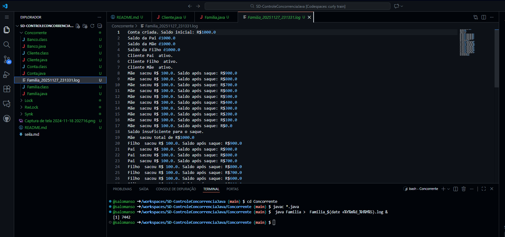
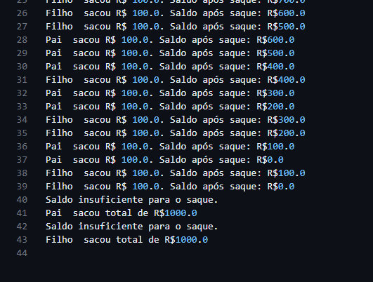

# Lock

* Aqui botamos em prática o lock, que faz exatamente o que eu disse acima. Para dissertar um pouco mais sobre, o lock literalmente locka(tranca) enquanto um thread acessa ou setta a informação, e assim que a mesma termina aplicamos o unlock(destrancar).

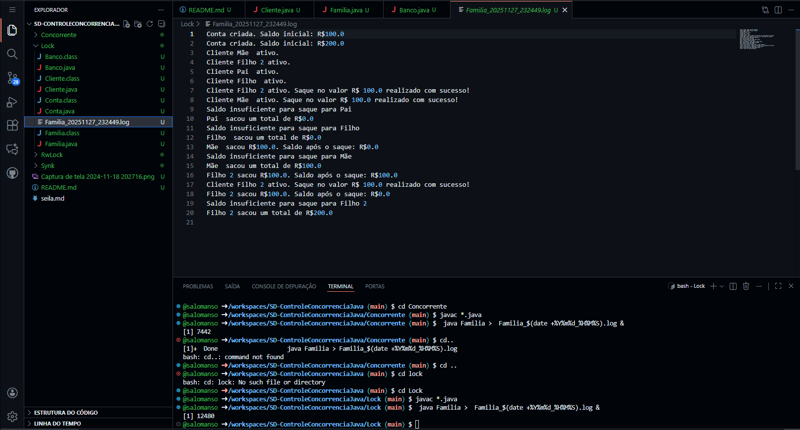
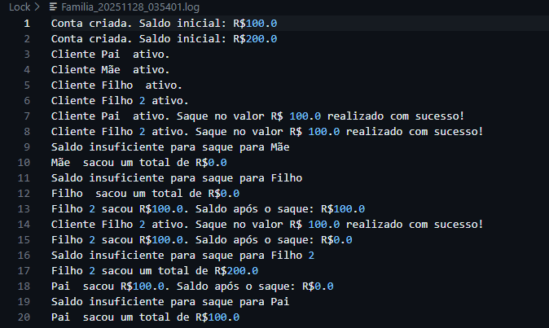
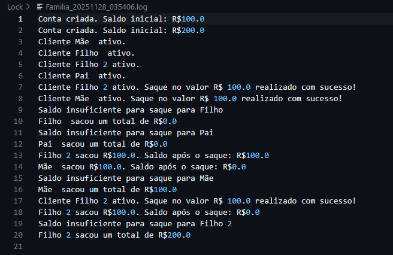

# RwLock

* Diferente do simples lock, aqui deixamos um pouco mais complexo. Usamos o readLock para que várias threads tenham o "direito" de ler, e o writeLock para dar o acesso exclusivo de UMA thread na escrita. Com isso, podemos fazer uma atualização melhor da leitura, e uma escrita contínua e protegida. Devo esclarecer que aparentemente esse método é eficiente quando se tem mais leituras do que escritas, na verdade, dada a explicação da senhora no git isso também já fica claro.

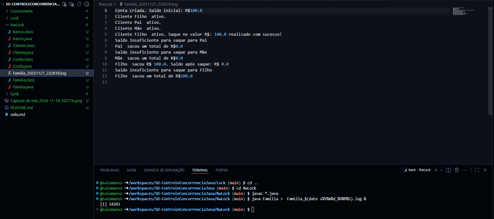
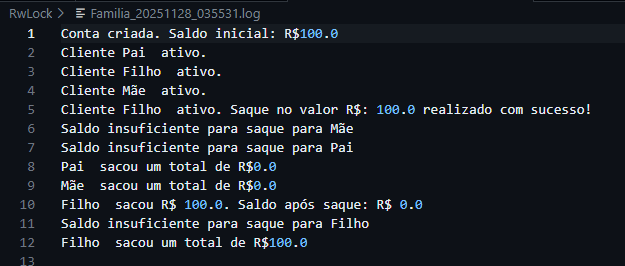
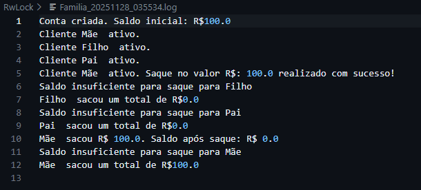

# Synk

* Usando synchronized, não precisamos mais utilizar explicitamente um Lock, pois o Java controla automaticamente o acesso ao recurso por meio de um monitor. Esse monitor garante que somente uma thread execute o trecho sincronizado por vez. Além disso, o próprio Java libera o monitor assim que o método ou bloco sincronizado termina. Dessa forma, eliminamos a possibilidade de race condition e não corremos o risco de esquecer de liberar o lock, problema que é aparentemente comum ao usar ReentrantLock.

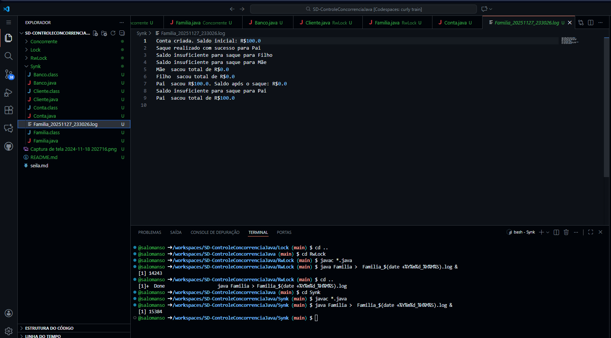
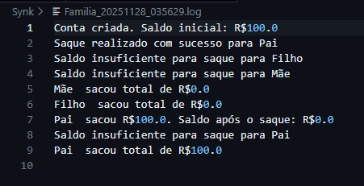
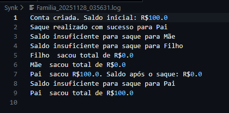